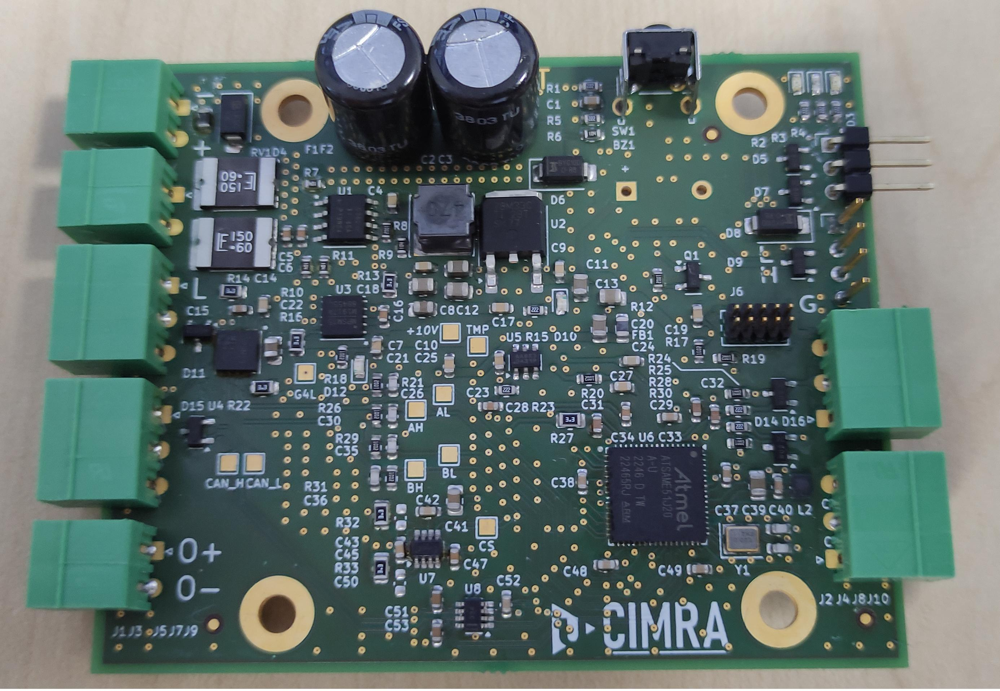

# Modular Current Source


## Specifications
### v2.0
- **U<sub>IN</sub>** = 12 - 48V
- **I<sub>OUT_DC</sub>** = &plusmn;10 A (max output power limited by PTC fuses to 144W/48V, current is load and input voltage dependent)
- **I<sub>OUT_AC</sub>** = &plusmn;10 A (0 A DC offset, max output power limited by PTC fuses to 144W/48V, current is load and input voltage dependent)
- **Waveforms:**
  - Harmonic with settable DC offset
  - Square with settable DC offset and Duty Cycle <0,100> %
  - Triangle with settable DC offset
- **Default settings:**  
  - I = 0 A
  - DC offset = 0
  - Duty Cycle = 50%
  - Waveform LUT not initialized (DC output set by default)
- **L<sub>load</sub>** at least 100&micro;H, preferably more than 150 &micro;H
- **Communication:**
  - **CAN FD**
    - Baudrate: 500 kb/s
  - **UART**
    - Baudrate: 921 600 Bd
    - 8 data bits
    - 1 stop bit
    - No parity

#### Set New ID
- **Command:** `ID`
- **Data:** Desired ID (0-250)
- **Description:** Sets a new ID for the current source.

**Example:**
```
1ID5  // Sets the ID of the current source to 5
```

#### Set Current
- **Command:** `I`
- **Data:** Desired current as a signed integer in mA (plus sign not allowed)
- **Description:** Sets the current for DC output and amplitude for AC output.

**Examples:**
```
1I650    // Sets current to 650mA for source ID 1
3I-5000  // Sets current to -5A for source ID 3
```

#### Choosing AC/DC Output
- **Commands:**
  - `D` - DC output
  - `A` - AC output
- **Data:**
  - `1` - Enable AC/DC output
  - `0` - Disable output
- **Note:** For AC output, waveform must be chosen first (see "Set Waveform").

**Examples:**
```
1D1  // Enables DC output for source ID 1
4A1  // Enables AC output for source ID 4
```

#### Set Waveform
- **Commands:**
  - `H` - Harmonic waveform
  - `S` - Square waveform
  - `T` - Triangle waveform
- **Data:** Desired frequency in Hz (unsigned integer)
- **Notes:**
  - Zero DC offset, duty cycle defaults to 50% (square)
  - Max waveform frequency from MoSeZ: **6000 Hz** (actual max depends on load)

**Examples:**
```
1H50     // Sets harmonic waveform at 50 Hz for source ID 1
3S6000   // Sets square waveform at 6000 Hz for source ID 3
2T1000   // Sets triangle waveform at 1000 Hz for source ID 2
```

#### Set DC Offset
- **Command:** `O`
- **Data:** Desired DC current offset of alternating current (signed integer in mA, plus sign not allowed)
- **Applicable for:** All AC waveforms

**Examples:**
```
1O650   // Sets DC offset to 650mA for source ID 1
3O-5000 // Sets DC offset to -5A for source ID 3
```

#### Set Duty Cycle (Square Wave Only)
- **Command:** `C`
- **Data:** Desired duty cycle in % (1-99)

**Examples:**
```
1C40  // Sets duty cycle to 40% for source ID 1
3C80  // Sets duty cycle to 80% for source ID 3
```

#### Set Ramp Time (Square Wave Only)
- **Command:** `RT`
- **Data:** Ramp time in percents (unsigned integer)

**Examples:**
```
1RT50  // Sets ramp time of square waveform to 50% (makes triangle waveform) for source ID 1
2RT10 // Sets ramp time of square waveform to 10% for source ID 2
```

#### Set Phase Shift
- **Command:** `F`
- **Data:** Phase shift in degrees (unsigned integer, 0-359)

**Examples:**
```
1F90   // Sets phase shift to 90° for source ID 1
3F180  // Sets phase shift to 180° for source ID 3
```

#### Position Control
- **Command:** `P`
- **Data:**
  - `1` - Enable position control
  - `0` - Disable output
- **Description:** Enables position control for a linear vibrator with position feedback.

**Example:**
```
9P1  // Enables position control for source ID 9
```

#### Set Position Amplitude
- **Command:** `R`
- **Data:** Position amplitude in micrometers (unsigned integer)
- **Constraints:**
  - **Max position offset + amplitude** ≤ 8 mm
  - **Min position offset - amplitude** ≥ 1 mm

**Examples:**
```
1R3500  // Sets position amplitude to 3.5 mm for source ID 1
5R1000  // Sets position amplitude to 1 mm for source ID 5
```

#### Set Position Offset
- **Command:** `V`
- **Data:** Position offset in micrometers (unsigned integer)
- **Constraints:** Same as "Set Position Amplitude"

**Examples:**
```
1V4000  // Sets position offset to 4 mm for source ID 1
5V7000  // Sets position offset to 7 mm for source ID 5
```

#### Start Logging Position to CAN
- **Command:** `CL`
- **Data:**
  - `1` - Start logging
  - `0` - Stop logging
- **Description:** Sends position data every millisecond (ID, actual position, requested position).

**Example:**
```
1CL1  // Starts position logging for source ID 1
```


#### Define Sequence (Whole Period)
- **Command:** `SP`
- **Data:** Duration of the sequence step in whole periods 
- **Description:** Starts defining a new/next sequence command step with a duration measured in whole periods of the waveform.

**Example:**
```
1SP5  // Starts a new sequence step with a duration of 5 whole periods for source ID 1
```


#### Define Sequence (Half Period)
- **Command:** `SH`
- **Data:** Duration of the sequence step in half periods 
- **Description:** Starts defining a new/next sequence command step with a duration measured in half periods of the waveform.

**Example:**
```
2SH10 // Starts a new sequence step with a duration of 10 half periods for source ID 2
```

#### Define Sequence (Milliseconds)
- **Command:** `SW`
- **Data:** Duration of the sequence step in milliseconds 
- **Description:** Starts defining a new/next sequence command step with a duration measured in milliseconds.
**Example:**
```
4SW100 // Starts a new sequence step with a duration of 100 milliseconds for source ID 4
```


#### Stop Filling Current Sequence
- **Command:** `SF`
- **Data:** No data required (value is ignored)
- **Description:** Stops adding commands to the currently being defined sequence step.

**Example:**
```
1SF  // Stops filling the current sequence step for source ID 1
```


#### Start Sequence
- **Command:** `ST`
- **Data:** Any value accepted
- **Description:** Starts the execution of a pre-configured sequence of commands.

**Example:**
```
1ST  // Starts the stored sequence for source ID 1
```

#### Clear All Sequences
- **Command:** `SC`
- **Data:** Any value accepted
- **Description:** Clears all pre-configured sequences of commands.

**Example:**
```
3SC  // Clears all stored sequences for source ID 3
```